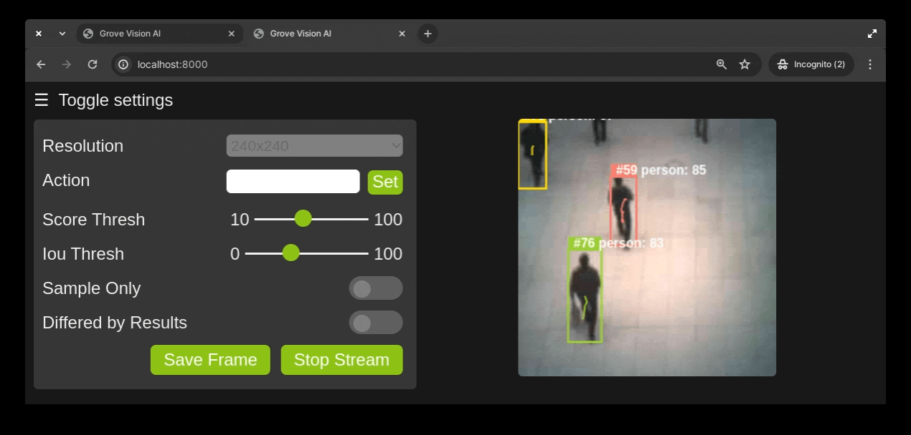

# Grove Vision AI V2 Web Camera Example

Run AI models, streaming, tracking and visualizing the results using [Grove Vision AI V2](https://www.seeedstudio.com/Grove-Vision-AI-V2-Kit-p-5852.html) on a web page, an expanded rework of [ESP32 CameraWebServer](https://github.com/espressif/arduino-esp32/tree/master/libraries/ESP32/examples/Camera/CameraWebServer).

## Prerequisites

Software:

- [Arduino IDE](https://www.arduino.cc/en/software)
- [Seeed_Arduino_SSCMA](https://github.com/seeed-studio/Seeed_Arduino_SSCMA)
- [ArduinoJson](https://arduinojson.org/v7/how-to/install-arduinojson/)
- [ArduinoEigen](https://www.arduino.cc/reference/en/libraries/eigen/)

Hardware:

- [Grove Vision AI V2](https://www.seeedstudio.com/Grove-Vision-AI-V2-Kit-p-5852.html)
- Espressif Arduino capble MCU board that supports Wi-Fi, e.g. [XIAO (ESP32)](https://www.seeedstudio.com/XIAO-ESP32S3-p-5627.html)
- Router

## Getting Started

1. Install the required libraries in Arduino IDE.
2. Open the example in Arduino IDE: `File` -> `Examples` -> `Seeed_Arduino_SSCMA` -> `camera_web_server`.
3. Select the correct board and port.
4. Edit the `ssid` and `password` in the `camera_web_server.ino` sketch to match your Wi-Fi network.
5. Upload the sketch to the board, and open the Serial Monitor, when connected to the Wi-Fi network, the IP address of the board will be printed, connect to it using a web browser.

## Features

### HTTP API

- `/` - Main page with a video stream from the camera
- `/stream` - Stream from the camera (stream server runs on port 8080)
    - `/stream/frame` - camera fream example
    - `/stream/result` - invoke/sample raw results in JSON format
- `/command?base64=` - Send a base64 encoded AT command to the board

### URL only streaming

You can use the URL `http://<IP_ADDRESS>/stream/frame` to view the camera stream on browsers or other APPS that support MJPEG streaming without any additinal process.

### AI inference results visualization

The web camera page supports visualizing bounding boexes, poses, classes and keypoints, and for each trackable objects (bounding boxes), we put a unique ID on its top left corner.

### Userfriendly error handling

The web camera page will notify the user if there is an issue during streaming and the potential cause of the issue, e.g. the camera cable is lossen, or the device lost connection to the Wi-Fi network.

